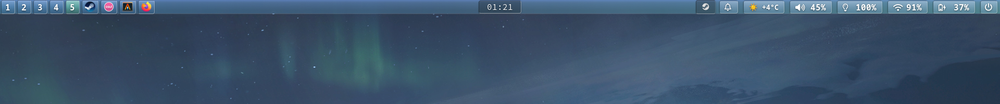
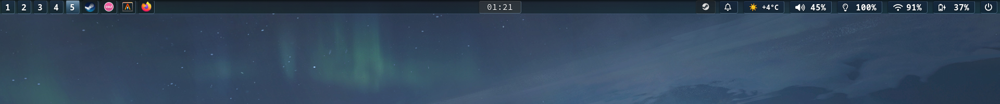

<h1 align="center">
waybar-glass
</h1>

[](LICENSE)

Clean and sleek Waybar config for skeuomorphism appreciators ✨☁️





## Features
- Sway and Hyprland support
- SwayNotificationCenter module
- Light and dark themes
- Screen brightness module as theme switching button
- Simple weather module

## Dependencies
[Waybar](https://github.com/Alexays/Waybar)

[Noto Sans font](https://fonts.google.com/noto/specimen/Noto%20Sans)

[Nerd Fonts](https://github.com/ryanoasis/nerd-fonts) (emojis)

[SwayNotificationCenter](https://github.com/ErikReider/SwayNotificationCenter) (notification center if you need it)

## Installation
1. Install Waybar and other dependencies aforementioned.
2. If you have another Waybar theme already installed, make sure to back it up first:
```bash
cp ~/.config/waybar ~/.config/waybarbackup -r
```

3. Run the following commands in the terminal:
```bash
cd ~
git clone https://github.com/NewbieSaibot/waybar-glass
cd waybar-glass
cp waybar ~/.config/ -r
```
4. Restart Waybar
```bash
killall waybar
waybar &
```
5. Make sure to change your city in `config.jsonc` `custom/weather` module and make other changes to your liking

Enjoy your Waybar!

> Issues and PR's are welcome.
