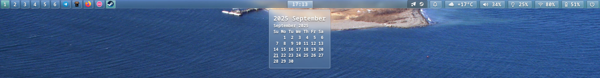

# waybar-glass
Clean and sleek Waybar config

## Screenshot



## Dependencies
[Noto Sans font](https://fonts.google.com/noto/specimen/Noto%20Sans)

[Nerd Fonts (for emojis)](https://github.com/ryanoasis/nerd-fonts)

[SwayNotificationCenter (for notification center, if you need it)](https://github.com/ErikReider/SwayNotificationCenter)

## How to install
1. Install Waybar
2. Run the following commands in the terminal:
```bash
cd ~
git clone https://github.com/NewbieSaibot/waybar-glass
cd waybar-glass
cp waybar ~/.config/ -r
```
3. Restart Waybar
```bash
killall waybar
waybar &
```
4. Make sure to change your city in config.jsonc (for weather) and make other changes to your liking

## How to install dark theme instead
5. Some of you may not like dark theme but here it is

```bash
cp darktheme.css ~/.config/waybar/style.css
```

Enjoy your theme!

